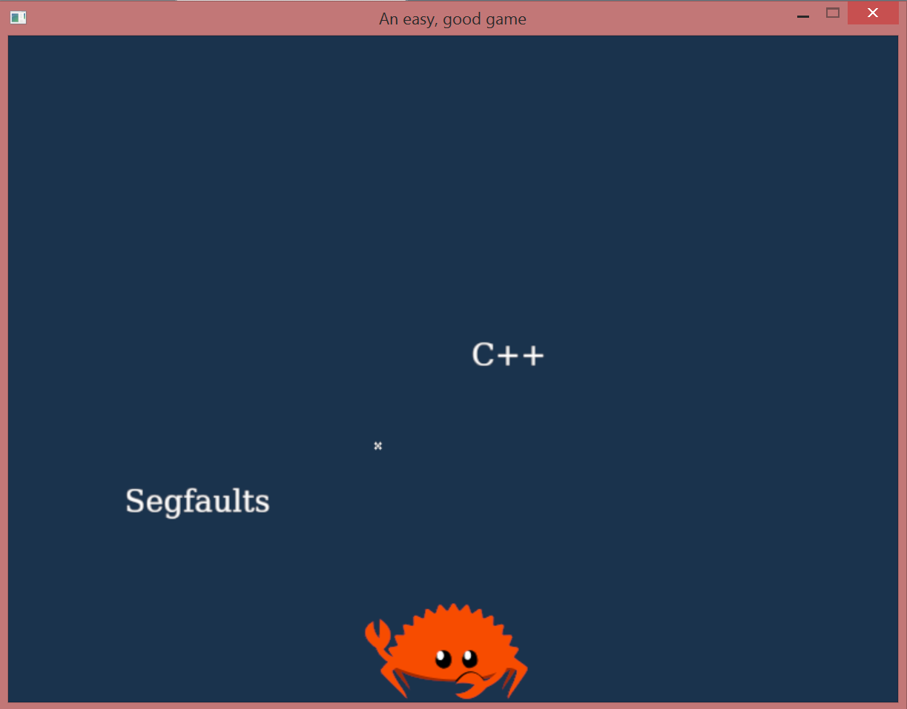

A toy game created to play around with the [ggez](https://github.com/ggez/ggez) framework for Rust. Involves Ferris the Crustacean shooting up the enemies of Rust: inefficiencies, undefined behaviour, and so on.

Running it with `cargo run` should be possible, but you might need to read up on the instructions for setting up SDL2: [Rust-SDL2](https://github.com/Rust-SDL2/rust-sdl2/blob/master/README.md)
